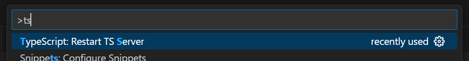

# CS732 examples - Full-stack w/ TypeScript!

This project is a direct clone of [example-22-fullstack](../example-22-fullstack/README.md), but migrated to use TypeScript, not JavaScript. You'll notice the code is very similar, just with a few type annotations (e.g. `: string`) scattered throughout. These type annotations are basically powerful annotations and removed when the project is compiled to JavaScript, so your JS knowledge is still very relevant!

This repository is set up with best practices for using TypeScript with Mongoose in a monorepo, so definitely refer to this if you're planning to set up your own TS repository!

## Setting Up TypeScript in Your Project

0. Before doing anything, get a feeling for how TS works.  
   https://www.youtube.com/watch?v=V78lbWLKMxo is a 5min intro.

1. Set up the monorepo  
   Because you'll need to share types between the frontend and backend, you can't put your types in either your frontend or backend folders. You'll need to set up a common package that is imported by both the frontend and backend* (actually, even if you're not using TypeScript this is a good idea - to share utility functions). The 'multi-app' repository you end up setting up is called a monorepo.  
   Check out how the four package.jsons in this project are set up, and copy the relevant parts into your own project.
   - Root: `workspaces` and `scripts` sections. `"common": "file:common"`.
   - Common: `exports` section and `common/src/index.ts` file
   - Frontend & backend: `"common": "file:../common"`
   
   Now, you can import say ArticleType with `import { ArticleType } from "common";` as if common was an npm package.

   \* There are many *many* ways to set up TypeScript monorepos, but this is the easiest for the projects you'll make in CS732. https://monorepo.tools/typescript is the best place to learn more.

2. Set up TypeScript  
   TypeScript is purely for you, the dev. When being run, TS first needs to be compiled to JS. We use `tsc` (`typescript` in the package.json) to compile TypeScript (e.g. for production builds) and `tsx` to run it directly for quick dev servers and scripts. Check out the package.jsons for the scripts!  
   Both `tsc` and `tsx` (which uses `tsc` under the hood) require a config file called `tsconfig.json` to work. Check out the four tsconfig.jsons along with `common/tsconfig-base.json` to get a feel for how they work. https://www.typescriptlang.org/tsconfig/ for the full reference but since they're just configs, I'd just copy these files and get experience modifying them when necessary.  
   
   IMPORTANT: to get TypeScript warnings and autocomplete in your IDE, you need to open VSCode to the folder containing the root `tsconfig.json` and possibly restart your TS server (`ctrl + shift + P`).
   

3. Use TypeScript  
   TypeScript is hopefully quite intuitive to pick up once you know JavaScript, but certain concepts that might be useful to Google (after learning the basics) are:
   - Type inference
   - Type narrowing & type guards
   - Unions types, e.g. `Article | string | null`
   - Duck typing "bigger types fit into smaller types"
   - Importing types
   - Generics, e.g. `useState<string>()`
   - Utility Types, e.g. `Omit<>`
   - `zod` runtime validation for TS
   - `@zodyac/zod-mongoose` zod schema -> mongoose schema
   - Environment variables (see `env.ts`)
   
   Most of these show up in this example. To quickly see all the TypeScript-specific comments, search up `!!! TypeScript !!!` using VSCode.

## Extra for Experts

If you've used TypeScript before and are looking for new cool stuff, check out:
- [`Zod`](https://zod.dev/) runtime schema & validation library that works well with TS
- [`@zodyac/zod-mongoose`](https://www.npmjs.com/package/@zodyac/zod-mongoose) zod schema -> mongoose schema
- [`Swagger`](https://swagger.io/) (OpenAPI) interactive documentation generated from your TS types
- [`TSOA`](https://tsoa-community.github.io/docs/) batteries-included Express.js (includes Zod & Swagger)
- [`tRPC`](https://trpc.io/) end-to-end type-safe APIs (if using Next.js, use [`next-safe-action`](https://next-safe-action.dev/) instead)
- [`DrizzleORM`](https://orm.drizzle.team/) type-safe SQL
- [`Mantine`](https://mantine.dev/) type-safe modern component library (more batteries-included, props-based)
- [`ShadCN`](https://ui.shadcn.com/) type-safe modern component library (more customisable, tailwind-based)
- [`ts-eslint`](https://typescript-eslint.io/) catch TS issues with ESLint
- [`monorepo.tools`](https://monorepo.tools/) advanced TS monorepo patterns (also see [`Nx`](https://nx.dev/))